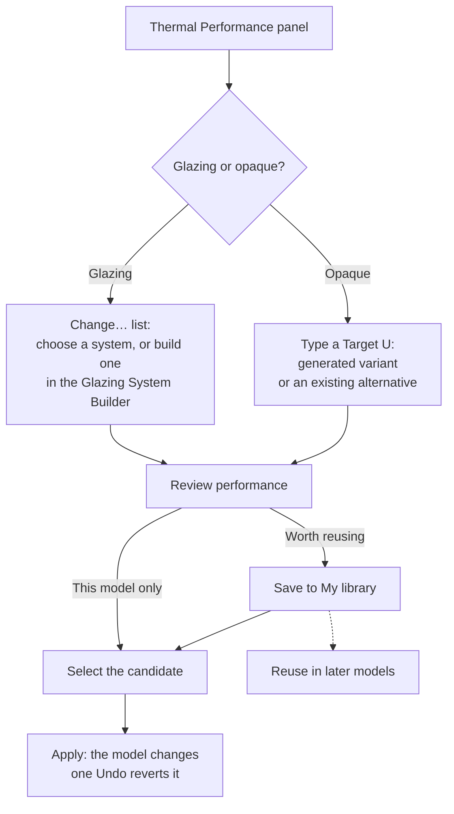
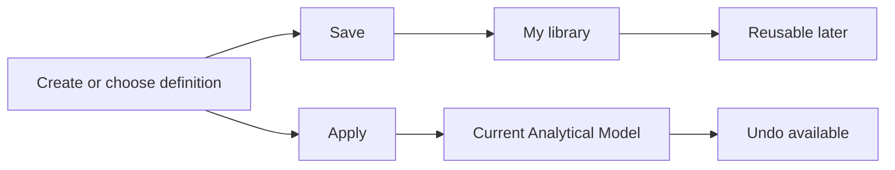

# SAM User Libraries and Builder

User guide for **My library**, the **Glazing System Builder** (called the Builder below) and **My constructions** in the SAM Thermal Performance panel.

*Documents the behaviour of SAM_UI branch `sow/2026-Q3` (User Libraries / Builder programme, PR1–PR6; the relevant source is unchanged since `a16ff93f`).*

**Contents**

*Orientation*
[1. What User Libraries are](#1-what-user-libraries-are) ·
[2. Workflow at a glance](#2-user-libraries-workflow-at-a-glance) ·
[3. Save versus Apply](#3-save-versus-apply) ·
[4. Choose what you want to do](#4-choose-what-you-want-to-do) ·
[5. First five minutes](#5-first-five-minutes)

*Glazing systems*
[6. Choose or create a glazing system](#6-choose-or-create-a-glazing-system) ·
[7. Build a glazing system](#7-build-a-glazing-system) ·
[8. Save and replace, explained](#8-save-and-replace-explained)

*Opaque constructions*
[9. Choose an opaque construction](#9-choose-an-opaque-construction) ·
[10. Generate a Target-U variant](#10-generate-a-target-u-variant) ·
[11. Save to My constructions](#11-save-to-my-constructions) ·
[12. Select and Apply](#12-select-and-apply)

*Managing and examples*
[13. My library](#13-my-library) ·
[14. Workflow examples](#14-workflow-examples)

*Reference*
[15. Provenance](#15-provenance--what-it-tells-you) ·
[16. Material conflicts](#16-material-conflicts) ·
[17. Validation messages](#17-validation-messages) ·
[18. Storage, identity and archive](#18-storage-identity-and-archive-behaviour) ·
[19. Current limitations](#19-current-limitations)

---

## 1. What User Libraries are

**My library** holds the reusable thermal definitions you create yourself. It has two kinds of content:

| Library | What it stores | Where it appears in SAM |
|---|---|---|
| **My glazing systems** | Complete glazing systems (panes, gas gaps and an optional frame) you built in the Glazing System Builder | As candidates in a window's **Change…** list |
| **My constructions** | Opaque constructions (walls, roofs, floors) you saved from the Thermal Performance panel or the Constructions editor | As **My constructions** alternatives on an opaque row |

A construction or glazing system you develop in one model is normally trapped in that model. A User Library keeps it, so you can use it in other models and in later SAM sessions, together with a record of where it came from and what U-values it had when you saved it.

**Your library and the Analytical Model are separate.**

| | Analytical Model (project) content | My library content |
|---|---|---|
| Belongs to | One analytical model | You, across all models and sessions |
| Changed by | **Apply** (one Undo step) | **Save**, **Rename**, **Remove** |
| Appears in Undo history | Yes | **No** |

---

## 2. User Libraries workflow at a glance

> [!IMPORTANT]
> After **Apply**, the model owns its own copy. Later changes to the User Library — a rename, a removal, a replacement — do not silently alter a model that already uses the item.

---

## 3. Save versus Apply

> **Save = keep for reuse. Apply = change this model.**

Saving never applies, and applying does not require saving — with one exception: a glazing system created in the Glazing System Builder must be saved before it can be chosen and applied, because the Builder itself has no Apply action. Existing systems and generated opaque variants can be applied without first saving them to My library.

| Action | Changes the model? | Adds an Undo step? |
|---|---|---|
| Open My library | No | No |
| Rename, Remove | No | No |
| Open in Builder, edit a draft, Cancel | No | No |
| Save as new / Save as predefined / Save and replace | No | No |
| Save to My constructions… | No | No |
| **Apply** | **Yes** | **Yes — one step** |

---

## 4. Choose what you want to do

Start from the **Thermal performance** panel.

| I want to… | Start here |
|---|---|
| Use an existing glazing system | **Thermal performance** → the glazing row → **Change…** |
| Create a glazing variation | **Change…** → right-click a system → **New system based on this…** |
| Build or edit a reusable glazing system | **Glazing System Builder** (**Change…** → **Create new…**, or **Open in Builder…**) |
| Generate an opaque construction for a target U-value | **Thermal performance** → the opaque row → **Target U** |
| Save an opaque construction | **Thermal performance** → the opaque row → **Save to My constructions…** |
| Reuse a saved opaque construction | The opaque row → type a **Target U** → **Alternatives** → entries marked **My constructions** |
| Review saved definitions | **Sources** → **My library…** |
| Rename or remove an item | **My library…** (or right-click a My glazing systems candidate in **Change…**) |
| Apply a definition to the project | Select the candidate → **Apply** |

---

## 5. First five minutes

1. Open the **Thermal performance** panel.
2. Find the glazing row or opaque construction you want to change.
3. Choose or create the alternative you need — glazing: **Change…**; opaque: type a **Target U**.
4. Review its thermal performance.
5. Save it to **My library** if it should be reusable (**Save as predefined** in the Builder, or **Save to My constructions…**).
6. Select the candidate you need for this project.
7. Review the **Before apply:** line and the one-line summary of the pending change.
8. Click **Apply**. One Undo reverts it.

---

## 6. Choose or create a glazing system

A window's glazing is chosen as a **complete system** (panes, gaps and frame together). Open the glazing row's **Change…** button; the list is headed **Choose a complete system**.

[Screenshot: Change… list for a glazing row]

### Routes

| I want to… | Do this | Result |
|---|---|---|
| Use an existing system | Select it in the **Change…** list | It becomes the pending change. The model is not changed until **Apply** |
| Start a new system from the current one | **Create new…** at the top of the list | A new Builder draft that starts from the system currently chosen in the list |
| Make a variation of any candidate | Right-click it → **New system based on this…** | An **independent copy** as a new Builder draft. The system you copied is not touched |
| Edit a system I saved | Right-click a My glazing systems candidate → **Open in Builder…** (or **My library…** → **Glazing systems** → **Open in Builder…**) | An editable draft based on the saved definition ([section 8](#8-save-and-replace-explained)) |
| Rename or remove a system I saved | Right-click a My glazing systems candidate → **Rename…** / **Remove…** | See [section 13](#13-my-library) |

**New system based on this…** is offered for every candidate. **Open in Builder…**, **Rename…** and **Remove…** are offered only for systems from My glazing systems.

Right-clicking a candidate opens its menu **without choosing it**, so it does not become the pending change.

### What the list shows

The list combines your model's own systems, the SAM default library, **My glazing systems**, and any sources you added with **Add source…**. The model's systems and My glazing systems are always listed; **Default library** and **Added sources** can be switched off under **⋯ Filters**. Filters also set a minimum/maximum g-value and a minimum light transmittance and the sort order. **Target Uw ≤** limits the list to systems with that overall U-value or better. Each entry shows `Uw · Ug · Uf · g · LT`. The list is sorted best overall Uw first by default (change it under **Sort by**), and the current system is always shown even if a filter would exclude it.

When you open the Builder from the **Change…** list (**Create new…**, **New system based on this…** or **Open in Builder…**), then save: after saving, the **Change…** list picks up the new system and chooses it as the pending change. The Analytical Model is still unchanged until **Apply**. (A Builder opened from **My library…** saves to the library but does not choose anything in the list.)

---

## 7. Build a glazing system

The Builder edits a temporary **draft**. It has no analytical model behind it: nothing you do in it changes a model until you save a system, choose it in the panel and click **Apply**. **Cancel** closes the Builder and discards the draft.

[Screenshot: Glazing System Builder — whole window]

A status line under the **Name** box shows where the draft stands, for example *New · based on SIM_EXT_GLZ · not saved* or *Editing a copy of X · saving creates a new system*.

### Start from an existing system

Starting from a known system is the quickest way to make a project variation: the panes, gaps and frame come across, and you change only what differs.

- **Create new…** starts from the system currently chosen in the **Change…** list.
- **New system based on this…** starts from the candidate you right-clicked.
- **Open in Builder…** starts from a saved system of yours.

In all cases you are editing a **copy**.

### Build the layers

The **Build-up (outside → inside)** list holds panes and gas gaps, with **OUTSIDE** at the top and **INSIDE** at the bottom.

| To… | Do this |
|---|---|
| Choose a pane | In the **Panes** browser on the right, select a source, search by name or category (for example `optitherm 4`), select a pane |
| Add a pane | **Add pane** — after the selected layer, or at the inside end when nothing is selected. If the new pane would touch the pane before it, SAM inserts a gap first (the previous gap's gas and width, else Argon 16 mm) |
| Change a pane | Select the pane, choose another in the browser, **Replace pane** |
| Add a gap | **Add gap** — Argon 16 mm, or like the last gap; enter the width in **mm** and press Tab to apply |
| Change the gas | Air, argon or krypton |
| Reorder | **↑ Outwards** / **↓ Inwards** (Alt+Up / Alt+Down) |
| Install a pane the other way round | **Reverse pane** — its outside- and inside-facing coating values swap |
| Remove a layer | **Remove** (Delete) |
| Add more panes to choose from | **Add source…** — a Tas glazing database (`.tcd`) or a JSON file of panes. It is remembered and also listed as a source in the Thermal Performance panel |

Gap widths from 4 to 30 mm are within the range where SAM's gas heat-transfer correlation (EN 673) is used; outside that range the Builder warns. Two panes in a row, or two gaps in a row, also produce a warning.

### Select the intended use

**Intended use** says what the system is for: **External wall**, **Roof (rooflight)**, **Exposed floor** or **Not chosen**. It is saved as the system's Default Panel Type and decides the orientation for which the gas-gap heat transfer is derived. Leaving it at **Not chosen** is allowed but gives a warning.

### Configure the frame

The **Frame** section of the Builder (below the build-up) controls the frame.

[Screenshot: Glazing System Builder — Frame authoring]

Open the **Frame** drop-down and choose one of:

| Choice | Meaning |
|---|---|
| **None (glass only)** | No frame; the system is glass only (Uw = Ug) |
| **Own frame (add the layers below)** | A frame you build; it starts with no layers |
| **Frame of *system*: *layers* (*source*)** | The frame of an existing system, **copied** into your draft. The existing system is not changed |

When the frame is **Own** or copied, the frame editor appears. Each layer shows its material and its thickness in **mm**.

| To… | Do this |
|---|---|
| Add a layer | Choose a material, then **Add layer**. It is added after the selected layer, or at the end when none is selected |
| Change a material | Select the layer, choose a material, click **Replace material**. The thickness stays |
| Change a thickness | Type in the layer's thickness box (**mm**) and press Tab |
| Reorder | Select the layer and click **↑ Up** / **↓ Down** |
| Remove | Select the layer and click **Remove layer** |

Removing the last layer leaves the system without a frame.

**Material search.** Type words in the search box above the material drop-down to find a material by name or source (for example `timber`). The list contains the **solid** materials of the model, the libraries and the added sources; a count (for example "3 of 120 solid materials") is shown below.

**Frame width.** Type the frame's face width in **mm** (press Tab) in **Frame width**. It is saved as the system's default frame width. The Builder also shows the frame **depth** (the sum of the layer thicknesses). If a copied frame stores no width, its depth is proposed as the width; change it if the face is different.

**Frame thermal result.** **Uf — frame layers, 1-D, Tas** is calculated by Tas from the layers as you edit them. **Frame additional heat transfer** is **read-only**: it shows the value carried by a copied frame (for example `20 %`) or `none`. An own frame never has one. Tas applies it on top of the frame layers, also after you edit the layers of a copied frame. You cannot type a declared Uf, and you cannot edit the additional heat transfer.

### Review thermal performance

The **Performance (Tas)** box recalculates as you edit:

| Value | Meaning |
|---|---|
| **Ug — centre of pane, Tas** | U-value of the glazing at the centre of the pane |
| **g — total solar energy transmittance** | Solar gain factor |
| **LT — light transmittance** | Visible light transmittance |
| **Uf — frame layers, 1-D, Tas** | U-value of the frame, from its layers |
| **Frame additional heat transfer** | Read-only; carried by a copied frame |

Below these is a labelled **Uw example**, for example *Uw example 1.31 W/m²K — 1.23 × 1.48 m, frame width 50 mm, no spacer Ψ*.

> [!NOTE]
> The example Uw is a **reference value for comparing builds**, not the Uw your model will get. It is the area-weighted U-value of the standard window of EN ISO 10077-1 (1.23 × 1.48 m), with your frame width all round and **no spacer linear transmittance (Ψ)**. When you apply a system, the model's own Uw is calculated from each window's own pane and frame areas. Without a frame the example is Ug. To see the example you must enter a frame width.

### Resolve warnings and errors

The validation summary and issue list under the build-up show the state of the draft:

- **Errors** prevent saving. **Save is disabled while there are errors.** *✕ n errors: it cannot be saved yet.*
- **Warnings** call for engineering judgement; the system can still be saved. *⚠ n warnings: it can be saved.*
- **✓ Ready to save** means no errors and no warnings.

The full list of messages is in [section 17](#17-validation-messages).

### Save the system

The first button depends on how you started:

| Started from | Button | Effect |
|---|---|---|
| **Create new…** or **New system based on this…** | **Save as predefined** | Adds a **new** system to My glazing systems |
| **Open in Builder…** on a saved system | **Save as new** | Adds a **new** system; the original stays exactly as it was. The name must differ from the original (the Builder shows a hint if it is the same) |
| **Open in Builder…** on a saved system | **Save and replace *name*** | Saves the result as a new definition and archives the one you opened ([section 8](#8-save-and-replace-explained)) |

The name must be new in My glazing systems. Saving does not change the model. If you opened the Builder from the **Change…** list, the saved system is then chosen there ([section 6](#6-choose-or-create-a-glazing-system)); you still have to click **Apply**. The Builder reports "Saved to My glazing systems as *name*" (or "…, replacing *name* (kept in the archive)").

**Cancel** closes the Builder without saving. The Builder does not currently ask for confirmation before discarding an edited draft.

---

## 8. Save and replace, explained

Use **Save and replace** when you intentionally want a revised definition to supersede the saved one — for example, you corrected the frame of a system you reuse on every project.

1. **Open in Builder…** on the saved system. You get an editable **copy**; the saved definition is not touched.
2. Edit the draft. The name may stay the same.
3. Click **Save and replace *name***.

What happens, in one operation:

- your revised definition is saved as a **new definition** in My glazing systems;
- the previous definition is **archived**, not deleted or overwritten;
- the new definition **records which one it superseded**;
- **models that already use the previous definition are not silently changed** — they keep their own copy.

If you would rather keep both, use **Save as new** with a different name.

SAM keeps a stable identity for each saved definition internally; you do not need to manage it (see [section 18](#18-storage-identity-and-archive-behaviour)).

---

## 9. Choose an opaque construction

For walls, roofs and floors, you choose alternatives from a **Target U**.

1. In the **Thermal performance** panel, find the opaque row.
2. Type a **Target U** (W/m²K).
3. The **Alternatives** list appears. Without a Target U, it is not shown.

The list holds:

- the **generated variant** first (see [section 10](#10-generate-a-target-u-variant)); it can be selected only when its target was reached;
- then the **existing constructions that meet the target or are within 10 % above it**, up to 30. Each shows its U-value, how far it is from the target, where it comes from (**Existing model**, **Library**, **My constructions** or the added source's name) and any warning.

Existing constructions come from your model, the SAM default library, **My constructions** and any added sources. Constructions that meet the target are listed first, then those that come close; within each group, constructions made for the panels' own type come first, then the closest to the target.

Once you type a Target U, the generated variant becomes the pending change (when its target can be reached). To use an existing construction instead, select it; SAM never chooses an existing construction for you. Then continue with [section 12](#12-select-and-apply). To keep an alternative for later, right-click it → **Save to My constructions…** ([section 11](#11-save-to-my-constructions)).

The Alternatives list covers constructions saved from any model or session: once saved, a construction is offered as a **My constructions** alternative on opaque rows in **every** model — whenever its U-value meets or is close to the Target U you type.

> [!NOTE]
> An alternative made for a different kind of panel (for example a roof construction offered for walls) is flagged with a warning. A same-named construction already in the model is added under a numbered name.

---

## 10. Generate a Target-U variant

When you type a **Target U** for an opaque row, SAM can generate a construction by adjusting one layer's thickness to reach it.

**Existing construction → enter Target U → generated variant → inspect build-up and performance → Save and/or Apply**

1. Select the opaque row and type the **Target U**.
2. The preview line shows the result, for example `U 0.260 → 0.180 · Mineral wool 80 → 124 mm`.
3. Inspect the generated build-up and the U-value. **⋯ More** offers **Keep name** (change the construction itself instead of creating a new one), **Layer to adjust**, **Thickness range [mm]** and **Heat flow**.
4. Then do either, both, or neither:
   - **Save to My constructions…** if the generated construction should become reusable. This does not apply it and does not change the model.
   - **Apply** if it should change this Analytical Model. This does not save it.

Saving and applying are independent.

If the target cannot be reached, the generated variant has no U-value and cannot be applied or saved as such; type a target the construction can reach. The **Save to My constructions…** button then saves the **current construction** instead; its tooltip shows which construction will be saved. (Right-clicking the unreachable generated variant and choosing **Save to My constructions…** is refused with the message in [section 17](#17-validation-messages).)

---

## 11. Save to My constructions

An opaque construction can be saved to **My constructions** as a **new, independent construction**. Only opaque constructions can be saved; transparent, gas-only and layerless constructions are refused with a message.

[Screenshot: Thermal Performance panel — opaque row with Save to My constructions…]

### What is saved

Click **Save to My constructions…** on the opaque row. SAM saves, in this order of preference:

1. the **alternative you have chosen** in the Alternatives list;
2. otherwise the **generated U-value variant** (once its target U-value is reached);
3. otherwise the **current construction** of the row.

The button's tooltip states exactly which of these will be saved. You can also right-click any alternative → **Save to My constructions…**; that saves the alternative you right-clicked **without choosing it**.

The construction is saved with its materials and a [provenance record](#15-provenance--what-it-tells-you).

### The name prompt

A **Save to My constructions** window asks for a **name**. The name must not be empty and must not already be used in My constructions (case and surrounding spaces are ignored); the problem is shown as you type. Click **Save**.

The panel then shows "Saved '*name*' to My constructions." If the save is refused (for example the name is taken, or a material is not in the material library), the message is shown in red and nothing is saved.

### Where it becomes available

In **every** model and session, as a **My constructions** alternative on opaque rows ([section 9](#9-choose-an-opaque-construction)), and in **My library** → **Constructions**.

### From the classic Constructions editor

The existing **Constructions** editor also provides **Save to My constructions…**. Select a construction, click the button and give it a name. The editor stays open; neither it nor the model is changed. There is no separate opaque layer editor in My library — author a construction in the Constructions editor (or by generating a variant) and save it as a new one.

> [!NOTE]
> Saving does **not** change the model, start an edit, choose anything, or affect a pending change.

---

## 12. Select and Apply

**Apply is the point where the Analytical Model changes.** Everything before it is preparation.

1. **Select the candidate** — a system in a glazing row's **Change…** list, or an alternative in an opaque row's **Alternatives** list. It becomes the pending change.
2. **Read the check.** The panel shows **Before apply:** with a one-line summary, for example *Assigns SIM_EXT_B to 12 panels; SIM_EXT_SLD stays unchanged.* Use **Details** where offered.
3. **Check the scope.** Under **Changes**, choose whether the change applies to all panels using the construction or only those you selected.
4. **Check materials.** When a system or construction from My library is applied, any material it needs that the model lacks is added to the model; the summary says "Adds *n* materials to the model" and lists them. If a material conflicts with the model, Apply is blocked ([section 16](#16-material-conflicts)).
5. Click **Apply**. SAM creates **one intended model change**.
6. **One Undo** reverts it. The panel notes "One Undo reverts it."

**Discard** drops the pending choice without changing the model.

After Apply, the model has its own copy; the library item and the model are independent afterwards. Removing or replacing the library item later does not retroactively change models that already use it.

---

## 13. My library

**My library** is where you review and tidy what you saved. Library management never changes the current model.

In the **Thermal performance** panel, under **Sources**, click **My library…**. It opens as a dialog over the panel with two tabs, **Glazing systems** and **Constructions**. Each shows a list on the left and a **Details** pane on the right; until you select an entry, the pane shows a hint.

[Screenshot: My library — Glazing systems tab]

[Screenshot: My library — Constructions tab]

> [!NOTE]
> You cannot apply anything from My library. To use an entry in the model, select it as a candidate in the Thermal performance panel and click **Apply** ([section 12](#12-select-and-apply)).

### Glazing systems tab

Each entry shows:

- **Name**, and the **date saved** (right-aligned)
- the **pane build-up** (thickness in mm, per layer)
- the values recorded when it was saved — `Ug · g · LT · Uf` — and the **frame** (frame layers, or "no frame")

The **Details** pane adds the system's short ID (the last 6 characters of its identity, which tells same-named systems apart), the full pane and frame layers (thicknesses in mm), the calculation engine used at save, and how it was built (see [section 15](#15-provenance--what-it-tells-you)). A system that was not made with the Builder is shown as having no Builder provenance.

The tab also has **Open in Builder…**, which opens the selected system for editing ([section 8](#8-save-and-replace-explained)).

### Constructions tab

Each entry shows:

- **Name** and **date saved**
- the **build-up** (thickness in mm, then material)
- **U-value at save** (W/m²K)
- the **heat-flow basis** the U-value was calculated for
- the **source** — where it was saved from

The **Details** pane adds the short ID, the date saved and the provenance lines (saved from, based on, model name, U-value at save, target, heat-flow basis, route, engine). There is no **Open in Builder…** for constructions.

### Rename

1. Select an entry and click **Rename…** (or press **F2**).
2. Type the new name. The naming rule is checked as you type: the name must not be empty and must not already be used by another entry (case and leading/trailing spaces are ignored).
3. Click **Rename** (or press Enter). **Cancel** (or Esc) abandons it.

Rename changes **only the name** shown in the library. The saved definition (layers, materials, values, provenance) and the item's identity are unchanged. Models that already use the item are not affected, and an open candidate list refreshes with the new name.

### Remove

1. Select an entry and click **Remove…** (or press **Delete**).
2. Confirm in the **Remove from My library** dialog.

Remove takes the item out of the active library. It is **archived, not deleted**: the definition is moved to a separate archive file (`Glazing Systems.removed.json` or `Constructions.removed.json`) next to the library, and the tab says so. Removed items no longer appear in My library or in the normal candidate lists. Models that already use the item keep their own copy.

> [!WARNING]
> There is no Restore command (see [Current limitations](#19-current-limitations)). Removed items stay in the archive file, but SAM cannot bring them back.

If a library file cannot be read, My library shows a warning, leaves the file untouched and disables changes until the problem is fixed.

---

## 14. Workflow examples

### A. Create a glazing variation

*Existing system → New system based on this… → modify → Save → Apply.*

1. In the Thermal performance panel, open a glazing row's **Change…** list.
2. Right-click the existing system → **New system based on this…**.
3. Edit the panes, gaps or frame in the Glazing System Builder; give it a new name.
4. Click **Save as predefined**.
5. Back in the **Change…** list, the new system is already chosen. Check it; the model has not changed yet.
6. Click **Apply**. One Undo reverts it.

### B. Develop a project-specific glazing system and keep it for future projects

*Builder → Save → Apply → reuse later.*

1. **Change…** → **Create new…**.
2. Build the panes, gaps and frame; set the **Intended use**; check Ug, g, LT and Uf.
3. Click **Save as predefined**. It is now in **My glazing systems**.
4. Back in the **Change…** list the new system is already chosen. Check it, then click **Apply**.
5. On a later project, open **Change…**: the system is listed under **My glazing systems** — select it and **Apply**.

### C. Create a construction to a target U-value

*Target U → generated variant → inspect → Save and/or Apply.*

1. Find the opaque construction's row.
2. Type a **Target U** (W/m²K). The preview line shows the generated construction.
3. Click **Save to My constructions…** and enter a unique name → **Save**. The model has not changed.
4. Optionally click **Apply** to use the generated construction now (one Undo reverts it).
5. Later, in any model, the construction appears under **My constructions** in the Alternatives list when its U-value meets or is close to the Target U you type.

### D. Reuse a previous project definition

*My library (review) → select candidate in the panel → Apply.*

1. Optionally open **My library…** and check the entry's recorded values and provenance in **Details**.
2. Glazing: open the row's **Change…** list and select the system under **My glazing systems**. Opaque: type a **Target U** and select the **My constructions** alternative.
3. Read **Before apply:**, then click **Apply**.

### E. Improve a saved glazing definition

*Open in Builder → modify → Save and replace.*

1. Click **My library…** → **Glazing systems** tab → select the system → **Open in Builder…**.
2. Edit the draft (the saved definition is not touched).
3. Click **Save and replace *name***.
4. The previous definition is moved to the archive; the edited result is now the available definition in My glazing systems. Models already using the old one are unchanged.

### F. Tidy the User Library

*Rename / Remove → no Analytical Model changes.*

1. **My library…** → pick a tab → select an entry.
2. **Rename…** to fix a label, or **Remove…** to archive it. Neither changes any model.

---

## 15. Provenance — what it tells you

Provenance is a quality-assurance record. When you save to My library, SAM records where the definition came from, so you can judge it later. The **Details** pane of each My library entry shows it.

### For glazing systems

| Question | Recorded |
|---|---|
| What was this system based on? | The system you copied or edited, or that it is not based on another system |
| Where did its panes and frame come from? | The origin of each pane, and of the frame: own frame, frame copied from a named system, or a copied frame you then edited |
| What Ug / g / LT / Uf did it have when saved? | The values calculated at save |
| Which engine produced them? | The calculation engine (Tas), and the SAM_Tas version |
| Did it supersede another saved definition? | For **Save and replace**, which definition it superseded |
| What was it designed for? | The intended use, and the orientation and basis used for the gap heat transfer |

Also recorded: when it was saved.

### For constructions

| Question | Recorded |
|---|---|
| Where was it saved from? | Generated variant, model, default library, an added source (by file name), My constructions, or the Constructions editor |
| What construction was it based on? | The construction it was based on, and the name of the model it was saved from |
| What U-value was recorded? | The **U-value at save** |
| Was a Target U used? | For a generated variant, the **target** U-value |
| Which heat-flow basis was used? | For example *Horizontal heat flow, external surfaces* |
| How was it obtained? | The route, and the engine that calculated it |

Also recorded: when it was saved.

Provenance travels with the definition into any model it is applied to. It contains names and file names only, never folder paths. Items that have no provenance (for example systems not built in the Builder) say so.

---

## 16. Material conflicts

A reusable construction or glazing definition may depend on materials that also exist in the target model. SAM matches materials **by name**. If a material has the **same name but different properties** (every property other than its internal identity), SAM **blocks Apply** rather than guessing which definition is correct. This is intentional: applying it would silently give the construction the model's properties instead of the ones you saved.

The candidate shows a warning such as *material differs from model*, and Apply is blocked with a message such as:

> *Its material 'X' differs from the model's material of the same name.*

SAM does not resolve the conflict automatically. To proceed:

1. Review the two material definitions (the model's and the one the item needs).
2. Either bring the model's material in line with the one the item needs, or choose a different item.
3. Select the candidate again.

### Missing materials

If a material is simply missing from its source, the message reads *Its material 'X' is not in …* (naming the source), and Apply is blocked. When saving, a construction whose material is not in the material library is refused: *… cannot be saved: its material '…' is not in the material library.*

### Materials the model lacks

A material with the same definition already in the model is reused. A material the model lacks is added when you Apply; the summary tells you how many ("Adds *n* materials to the model").

### In the Builder

When two panes of the same name from different sources are used in one draft, SAM keeps both definitions under distinct names (for example *name (source)*, or *name 2*) rather than replacing one with the other.

---

## 17. Validation messages

### Glazing System Builder

| Message (abridged) | Severity | What to do |
|---|---|---|
| The system needs a name. | Error | Enter a name |
| A system named '…' is already in My glazing systems; choose another name. | Error | Use another name (**Save and replace** may keep the name) |
| Pane *n*: it has no thickness. / Gap *n*: it has no width. | Error | Set a thickness or width |
| Pane *n*: '…' is not a glass pane. | Error | Choose a glass pane |
| Pane *n*: its material '…' is not available. | Error | Replace the pane |
| Gap *n*: no gas is chosen. / … is not offered; use air, argon or krypton. | Error | Choose a supported gas |
| Gap *n*: … mm is outside 4–30 mm, where the gas heat transfer correlation (EN 673) is used here. | Warning | Check the gap width |
| Pane *n* touches the pane before it / Gap *n* follows another gap | Warning | Check the build-up |
| No intended use is chosen … | Warning | Choose an **Intended use** |
| Frame layer *n*: it has no thickness. / its thickness must be more than 0. | Error | Enter a positive thickness in mm |
| Frame layer *n*: '…' is a gas; a frame layer needs a solid material. | Error | Choose a solid material |
| Frame layer *n*: '…' is a glass material; Tas will calculate the frame as glazing. | Warning | Usually choose a different material |
| The frame width is not a positive number of millimetres. | Error | Enter a positive width or leave it empty |
| The frame has no width: SAM would use the frame layers' depth as the frame width. | Warning | Enter a width |
| No frame: the system is glass only (Uw = Ug). | Info | — |

A summary line shows *✓ Ready to save*, *⚠ n warnings: it can be saved* or *✕ n errors: it cannot be saved yet*.

### My library and Save to My constructions

| Message | Meaning |
|---|---|
| A system named '…' is already in My glazing systems. | Rename target is taken |
| The construction needs a name. / A construction named '…' is already in My constructions; choose another name. | Name rule |
| … cannot be saved: its material '…' is not in the material library. | The construction's material is unavailable |
| … cannot be saved to My constructions: only opaque constructions can … | Transparent/gas constructions belong with glazing systems |
| The generated variant has no U-value yet: type a target U-value the construction can reach. | Enter a reachable target first |

A refused Rename, Remove or Save is shown in red; the library is unchanged.

### Apply

| Message | Meaning |
|---|---|
| Its material '…' differs from the model's material of the same name. | Material conflict — [section 16](#16-material-conflicts) |
| Its material '…' is not in … | Missing material — [section 16](#16-material-conflicts) |

---

## 18. Storage, identity and archive behaviour

### Where things are stored

Both libraries are stored in your user profile, not in any model:

| Library | File (in `Documents\SAM\User Libraries`) | Archive of removed items |
|---|---|---|
| My glazing systems | `Glazing Systems.json` | `Glazing Systems.removed.json` |
| My constructions | `Constructions.json` | `Constructions.removed.json` |

Saved items therefore persist across models and later SAM sessions. The archive file sits next to each library and is not used by SAM except to keep removed definitions.

### Identity

- Each saved definition has a stable identity (a Guid) that tells same-named items apart. The **short ID** shown in Details and tooltips is its last 6 characters.
- Saved items are **immutable**: every Save adds a new item and never changes an existing one.
- **Rename** keeps the identity, layers, materials and history; only the name changes.
- **Save as new**, **Save as predefined** and **Save to My constructions…** always create a **new** identity.
- **Save and replace** creates a new identity for the replacement, archives the previous one, and records it in the new definition's provenance as *superseded*.

### Archive behaviour

- **Remove** moves the item — and the materials no remaining item uses — to the archive. Nothing is deleted. The archive is written first, then the library; if the archive cannot be written, nothing changes, so an entry is never lost.
- **Save and replace** archives the previous definition in the same operation. The new system is not saved unless the old one is archived.

### Candidate source ordering

Where the same item is offered by more than one source, **the first occurrence wins** (matched by identity):

| List | Source order |
|---|---|
| Glazing **Change…** list | Model → Default library → My glazing systems → Added sources |
| Opaque **Alternatives** list | Model → Default library → My constructions → Added sources |

For example, a saved construction that is already in the model shows as the model's.

This order decides which source an item belongs to, not how the list is displayed. For the display order and filters see [section 6](#6-choose-or-create-a-glazing-system) (glazing) and [section 9](#9-choose-an-opaque-construction) (opaque).

### Replacement and provenance details

A system saved with **Save and replace** records the superseded system's name and identity. Other recorded fields include the system's base (name and identity), the frame it was copied from (name and identity), per-pane and per-gap records, the calculated Ug / g / LT / Uf and the engine and version that produced them.

---

## 19. Current limitations

The following functionality is **not currently provided**:

- **No Restore** for archived items. Removed systems and constructions stay in the archive files but there is no command to bring them back.
- **No Duplicate** command in My library. (Use **New system based on this…** or **Save as new** for glazing; save an alternative again under a new name for constructions.)
- **No hard-delete** workflow. Remove always archives.
- **No declared frame Uf / synthetic equivalent frame.** Frame additional heat transfer is read-only; you cannot type a Uf.
- **No dedicated frame material editor.** Frame layers use existing solid materials.
- **No dedicated opaque material or layer editor in My library.** Constructions are authored in the Constructions editor or generated from a target U-value, then saved.
- **No "reset frame to the original copy"** command. To discard the current draft changes, Cancel and reopen the Builder; reopening a saved system only opens a fresh draft and changes nothing in the library.
- **No confirmation when you cancel or close** the Builder with an edited draft; the draft is discarded.
- **No automatic resolution of material conflicts** ([section 16](#16-material-conflicts)).
- **No applying from My library.** Entries are applied from the Thermal performance panel.
- Only **opaque** constructions can be saved to My constructions; glazing systems are saved through the Builder.

---

## Appendix: Screenshots

This guide does not embed screenshots. The bracketed placeholders mark where one would help:

- Change… list for a glazing row
- My library — Glazing systems tab; My library — Constructions tab
- Glazing System Builder — whole window; Glazing System Builder — Frame authoring
- Thermal Performance panel — opaque row with Save to My constructions…
